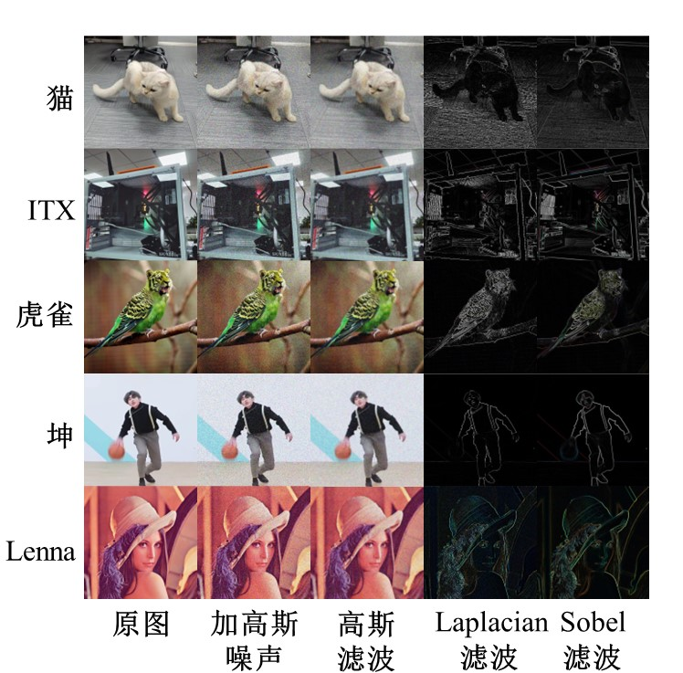

# 基于 Jetson Nano 的并行图像滤波算法优化

<div align="center">
    
</div>

我们实现了基于 GPU (CUDA) 和 CPU (PThread) 的卷积算法，在此基础之上，我们进一步实现 Sobel、Laplacian、均值和高斯滤波器，它们可以被用于图像处理，一个典型的应用场景就是图像降噪。
因此，我们的实验内容主要围绕这些滤波器在图像降噪上效果和它们在Jetson Nano 上的性能表现展开。

<div align="center">
    
</div>

我们分别从两个角度对这些滤波器进行上层封装，即实验角度和部署角度。
既然谈到部署，当然不能局限于人工输入图像，因此，我们加入了摄像头。

您只需要一个普通的USB摄像头，和 Nvidia Jetson 系列下的任意产品即可完整体验我们的项目。
当然，我们的项目是可以在任意支持 CUDA 的 x86 或 ARM 平台上运行的。
当您需要在 x86平台运行我们的项目时，您只需要重新编译即可。
本文档中提供编译指令。


**注意：Nano支持最大线程数为 $1024$，在我们的项目中，实际线程数等于 Block Size 的平方。也就是是说，Block Size 最大为 $32$。**


| 项目分工 | 人员 | 相关文件 |
| :---: | :---: | :---: |
|基于`PThread`的矩阵运算<br>和卷积算法|SJH| [conv_cpu.cpp](src/core/conv_cpu.cpp)|
|基于`CUDA`的矩阵运算<br>和卷积算法|ZDY| [conv_gpu.cu](src/core/conv_gpu.cu) |
|上层应用（图像滤波）<br>项目整合|HQD| 其余内容 |


## 硬件特性

我们的核心算法（卷积）最初是在 x86 架构的 Linux 上进行的，但所有的实验和部署都是在 Jetson Nano （ARM 架构）上进行。

据 Nvidia 官网：
> Jetson Nano 包含一个基于 Maxwell 架构的 GPU，具有 128 个 CUDA 核心和 4GB 的 LPDDR4 内存，最大内存带宽为 25.6 GB/s。此外，Jetson Nano 还配备了一个四核 ARM Cortex-A57 CPU，最高主频为 1.43 GHz。

执行下列语句查看 Jetson Nano 信息：
```shell
./executable/infoNano
```

`infoNano`由下列命令编译：
```shell
nvcc src/utils/infoNano.cu -w -O3 -o executable/infoNano
```


##  实验材料

通过 [materials.py](utils/materials.py)为 实验生成材料，实验材料包括：
- 一组原图
- 一组加高斯噪声的图
- 一组加椒盐噪声的图
- 一组加泊松噪声的图  
*这些图像被存储在 [images/Origin](images/Origin) 目录下。*

执行下列语句，即可对 [images/Origin](images/Origin) 目录下的图片增加不同噪声：
```shell
python3 src/utils/materials.py
```


## 实验

**注意：所有的程序都不会创建目录，因此需要确保输出路径存在，否则将无法得到图片结果。**  


### 编译

#### 快速开始

你可以执行 `buildAll.sh` 以编译所有程序。
```shell
sh buildAll.sh
```

#### CPU 滤波

编译 Gauss、Laplacian、Mean和Sobel多合一滤波器：
```shell
g++ src/exp/expCPU.cpp src/filters/cpuFilters.cpp src/utils/utils.cpp src/core/conv_cpu.cpp -Iinclude -O3 -w -pthread -o executable/exp/cpuFilter `pkg-config --cflags --libs opencv4`
```

对实验材料执行滤波
```shell
./executable/exp/cpuFilter mean images/Origin/ output/CPU 2 3 
```
>【Filter】：滤波器类型，可选 `gauss` `lap` `mean` `sobel`  
>【Input (Image) Path】：输入图片路径，可以是图片或目录  
>【Output Path】：输出图片路径，只能是目录    
>【Num of Thread】：线程数  
>【Kernel Size】：对于一些滤波器这个参数可能是无效的  
>【Sigma】：对于一些滤波器这个参数可能是无效的 


#### GPU 滤波

编译 Gauss、Laplacian、Mean和Sobel多合一滤波器：
```shell
nvcc src/exp/expGPU.cpp src/filters/gpuFilters.cpp src/core/conv_gpu.cu src/utils/utils.cpp -Iinclude -O3 -w -o executable/exp/gpuFilter `pkg-config --cflags --libs opencv4`
```

对实验材料执行滤波 
```shell
./executable/exp/gpuFilter sobel images/Origin/ output/exp/ 32
```
>【Filter】：滤波器类型，可选 `gauss` `lap` `mean` `sobel`  
>【Input (Image) Path】：输入图片路径，可以是图片或目录  
>【Output Path】：输出图片路径，只能是目录  
>【Block Size】：实际值为传入值的平方  
>【Kernel Size】：对于一些滤波器这个参数可能是无效的  
>【Sigma】：对于一些滤波器这个参数可能是无效的 


#### OpenCV 滤波

编译 Gauss、Laplacian、Mean和Sobel多合一滤波器：
```shell
nvcc src/exp/expOpenCV.cpp src/filters/openCVFilters.cpp src/utils/utils.cpp -Iinclude -O3 -w -o executable/exp/openCVFilter `pkg-config --cflags --libs opencv4`
```

对实验材料执行滤波
```shell
./executable/exp/openCVFilter sobel images/Origin/ output/epx/
```
>【Filter】：滤波器类型，可选 `gauss` `lap` `mean` `sobel`  
>【Input (Image) Path】：输入图片路径，可以是图片或目录  
>【Output Path】：输出图片路径，只能是目录   
>【Kernel Size】：对于一些滤波器这个参数可能是无效的  
>【Sigma】（必须）：对于一些滤波器这个参数可能是无效的  

## 部署

与实验部分的编译内容不同的是，每个滤波器是独立的，并没有被集成到一个对象，因此它们占用资源更少。  

### 编译

编译相机
```shell
g++ src/deploy/capture.cpp src/utils/utils.cpp -o executable/deploy/capture  -O3 -w -Iinclude `pkg-config --cflags --libs openc
v4`
```

捕获视频
```shell
./executable/deploy/capture 
```
> 【Camera】：相机编号  
> 【FPS】：写入帧率  
> 【Path to save Video】：保存路径  

#### CPU

编译 Gaussian Filter 部署应用
```shell
g++ -pthread src/deploy/cpuGauss.cpp src/filters/cpuFilters.cpp src/utils/utils.cpp src/core/conv_cpu.cpp -Iinclude -O3 -w -o executable/deploy/cpuGauss `pkg-config --cflags --libs opencv4`
```

编译 Laplacian Filter 部署应用
```shell
g++ -pthread src/deploy/cpuLap.cpp src/filters/cpuFilters.cpp src/utils/utils.cpp src/core/conv_cpu.cpp -Iinclude -O3 -w -o executable/deploy/cpuLap `pkg-config --cflags --libs opencv4`
```

编译 Mean Filter 部署应用
```shell
g++ -pthread src/deploy/cpuMean.cpp src/filters/cpuFilters.cpp src/utils/utils.cpp src/core/conv_cpu.cpp -Iinclude -O3 -w -o executable/deploy/cpuMean `pkg-config --cflags --libs opencv4`
```

编译 Sobel Filter 部署应用
```shell
g++ -pthread src/deploy/cpuSobel.cpp src/filters/cpuFilters.cpp src/utils/utils.cpp src/core/conv_cpu.cpp -Iinclude -O3 -w -o executable/deploy/cpuSobel `pkg-config --cflags --libs opencv4`
```

#### GPU

编译 Gaussian Filter 部署应用
```shell
nvcc src/deploy/gpuGauss.cpp src/filters/gpuFilters.cpp src/utils/utils.cpp src/core/conv_gpu.cpp -Iinclude -O3 -w -o executable/deploy/gpuGauss `pkg-config --cflags --libs opencv4`
```

编译 Laplacian Filter 部署应用
```shell
nvcc src/deploy/gpuLap.cpp src/filters/gpuFilters.cpp src/utils/utils.cpp src/core/conv_gpu.cpp -Iinclude -O3 -w -o executable/deploy/gpuLap `pkg-config --cflags --libs opencv4`
```

编译 Mean Filter 部署应用
```shell
nvcc src/deploy/gpuMean.cpp src/filters/gpuFilters.cpp src/utils/utils.cpp src/core/conv_gpu.cpp -Iinclude -O3 -w -o executable/deploy/gpuMean `pkg-config --cflags --libs opencv4`
```

编译 Sobel Filter 部署应用
```shell
nvcc src/deploy/gpuSobel.cpp src/filters/gpuFilters.cpp src/utils/utils.cpp src/core/conv_gpu.cpp -Iinclude -O3 -w -o executable/deploy/gpuSobel `pkg-config --cflags --libs opencv4`
```

#### OpenCV

编译 Gaussian Filter 部署应用
```shell
g++ src/deploy/openCVGauss.cpp src/filters/openCVFilters.cpp src/utils/utils.cpp -Iinclude -O3 -w -o executable/deploy/openCVGauss `pkg-config --cflags --libs opencv4`
```

编译 Laplacian Filter 部署应用
```shell
g++ src/deploy/openCVLap.cpp src/filters/openCVFilters.cpp src/utils/utils.cpp -Iinclude -O3 -w -o executable/deploy/openCVLap `pkg-config --cflags --libs opencv4`
```

编译 Mean Filter 部署应用
```shell
g++ src/deploy/openCVMean.cpp src/filters/openCVFilters.cpp src/utils/utils.cpp -Iinclude -O3 -w -o executable/deploy/openCVMean `pkg-config --cflags --libs opencv4`
```

编译 Sobel Filter 部署应用
```shell
g++ src/deploy/openCVSobel.cpp src/filters/openCVFilters.cpp src/utils/utils.cpp -Iinclude -O3 -w -o executable/deploy/openCVSobel `pkg-config --cflags --libs opencv4`
```

### 运行

#### CPU 

运行 Gaussian Filter 部署应用
```shell
./executable/deploy/cpuGauss 0 32 1 0.5 on on on
```
>【Camera/Video】：相机/视频路径，视频仅支持MP4  
>【Num of Thread】  
>【Kernel Size】  
>【Sigma】  
>【Open Origin】：开启原图窗口 （设置为“on”时开启，其他情况不开启）  
>【Save Origin Video】：保存原视频 （设置为“on”时开启，其他情况不开启）  
>【Save Output Video】：保存输出视频（设置为“on”时开启，其他情况不开启）  

运行 Laplacian Filter 部署应用
```shell
./executable/deploy/cpuLap 0 32 on on on
```
>【Camera/Video】：相机/视频路径，视频仅支持MP4  
>【Num of Thread】   
>【Open Origin】：开启原图窗口 （设置为“on”时开启，其他情况不开启）  
>【Save Origin Video】：保存原视频 （设置为“on”时开启，其他情况不开启）  
>【Save Output Video】：保存输出视频（设置为“on”时开启，其他情况不开启）  

运行 Mean Filter 部署应用
```shell
./executable/deploy/cpuMean 0 32 5 on on on
```
>【Camera/Video】：相机/视频路径，视频仅支持MP4  
>【Num of Thread】  
>【Kernel Size】    
>【Open Origin】：开启原图窗口 （设置为“on”时开启，其他情况不开启）  
>【Save Origin Video】：保存原视频 （设置为“on”时开启，其他情况不开启）  
>【Save Output Video】：保存输出视频（设置为“on”时开启，其他情况不开启）  


运行 Sobel Filter 部署应用
```shell
./executable/deploy/cpuSobel 0 32 on on on
```
>【Camera/Video】：相机/视频路径，视频仅支持MP4  
>【Num of Thread】   
>【Open Origin】：开启原图窗口 （设置为“on”时开启，其他情况不开启）  
>【Save Origin Video】：保存原视频 （设置为“on”时开启，其他情况不开启）  
>【Save Output Video】：保存输出视频（设置为“on”时开启，其他情况不开启） 

#### GPU

运行 Gaussian Filter 部署应用
```shell
./executable/deploy/gpuGauss 0 32 1 0.5 on on on
```
>【Camera/Video】：相机/视频路径，视频仅支持MP4  
>【Block Size】  
>【Kernel Size】  
>【Sigma】  
>【Open Origin】：开启原图窗口 （设置为“on”时开启，其他情况不开启）  
>【Save Origin Video】：保存原视频 （设置为“on”时开启，其他情况不开启）  
>【Save Output Video】：保存输出视频（设置为“on”时开启，其他情况不开启）  

运行 Laplacian Filter 部署应用
```shell
./executable/deploy/gpuLap 0 32 on on on
```
>【Camera/Video】：相机/视频路径，视频仅支持MP4  
>【Block Size】   
>【Open Origin】：开启原图窗口 （设置为“on”时开启，其他情况不开启）  
>【Save Origin Video】：保存原视频 （设置为“on”时开启，其他情况不开启）  
>【Save Output Video】：保存输出视频（设置为“on”时开启，其他情况不开启）  

运行 Mean Filter 部署应用
```shell
./executable/deploy/gpuMean 0 32 5 on on on
```
>【Camera/Video】：相机/视频路径，视频仅支持MP4  
>【Block Size】  
>【Kernel Size】    
>【Open Origin】：开启原图窗口 （设置为“on”时开启，其他情况不开启）  
>【Save Origin Video】：保存原视频 （设置为“on”时开启，其他情况不开启）  
>【Save Output Video】：保存输出视频（设置为“on”时开启，其他情况不开启）  


运行 Sobel Filter 部署应用
```shell
./executable/deploy/gpuSobel 0 32 on on on
```
>【Camera/Video】：相机/视频路径，视频仅支持MP4  
>【Block Size】   
>【Open Origin】：开启原图窗口 （设置为“on”时开启，其他情况不开启）  
>【Save Origin Video】：保存原视频 （设置为“on”时开启，其他情况不开启）  
>【Save Output Video】：保存输出视频（设置为“on”时开启，其他情况不开启）  

#### OpenCV


运行 Gaussian Filter 部署应用
```shell
./executable/deploy/openCVGauss 0 1 0.5 on on on
```
>【Camera/Video】：相机/视频路径，视频仅支持MP4  
>【Block Size】  
>【Kernel Size】  
>【Sigma】  
>【Open Origin】：开启原图窗口 （设置为“on”时开启，其他情况不开启）  
>【Save Origin Video】：保存原视频 （设置为“on”时开启，其他情况不开启）  
>【Save Output Video】：保存输出视频（设置为“on”时开启，其他情况不开启）  

运行 Laplacian Filter 部署应用
```shell
./executable/deploy/openCVLap 0 on on on
```
>【Camera/Video】：相机/视频路径，视频仅支持MP4    
>【Open Origin】：开启原图窗口 （设置为“on”时开启，其他情况不开启）  
>【Save Origin Video】：保存原视频 （设置为“on”时开启，其他情况不开启）  
>【Save Output Video】：保存输出视频（设置为“on”时开启，其他情况不开启）  

运行 Mean Filter 部署应用
```shell
./executable/deploy/openCVMean 0 5 on on on
```
>【Camera/Video】：相机/视频路径，视频仅支持MP4   
>【Kernel Size】    
>【Open Origin】：开启原图窗口 （设置为“on”时开启，其他情况不开启）  
>【Save Origin Video】：保存原视频 （设置为“on”时开启，其他情况不开启）  
>【Save Output Video】：保存输出视频（设置为“on”时开启，其他情况不开启）  


运行 Sobel Filter 部署应用
```shell
./executable/deploy/openCVSobel 0 on on on
```
>【Camera/Video】：相机/视频路径，视频仅支持MP4    
>【Open Origin】：开启原图窗口 （设置为“on”时开启，其他情况不开启）  
>【Save Origin Video】：保存原视频 （设置为“on”时开启，其他情况不开启）  
>【Save Output Video】：保存输出视频（设置为“on”时开启，其他情况不开启）  
